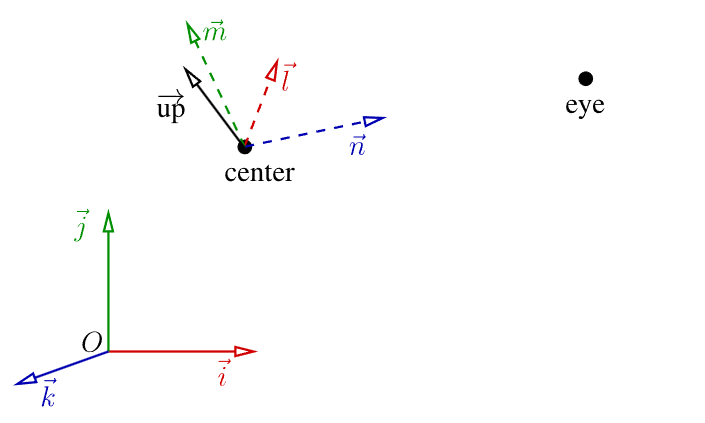

```cpp
#include <algorithm>
#include <cmath>
#include "geometry.h"
#include "model.h"
#include "tgaimage.h"

#define M_PI 3.14159265358979323846

constexpr int width = 800;
constexpr int height = 800;

constexpr TGAColor white = {255, 255, 255, 255}; // attention, BGRA order
constexpr TGAColor green = {0, 255, 0, 255};
constexpr TGAColor red = {0, 0, 255, 255};
constexpr TGAColor blue = {255, 128, 64, 255};
constexpr TGAColor yellow = {0, 200, 255, 255};

mat<4, 4> ModelView, Viewport, Perspective;

// 透视投影
vec3 persp(vec3 v)
{
    constexpr double c = 3.;
    return v / (1 - v.z / c);
}

// 视口变换矩阵
void viewport(const int x, const int y, const int w, const int h)
{
    Viewport = {{{w / 2., 0, 0, x + w / 2.}, {0, h / 2., 0, y + h / 2.}, {0, 0, 1, 0}, {0, 0, 0, 1}}};
}

// 透视投影矩阵 projection matrix (f是焦距, f越大, 视野越窄)
void perspective(const double f)
{
    Perspective = {{{1, 0, 0, 0}, {0, 1, 0, 0}, {0, 0, 1, 0}, {0, 0, -1 / f, 1}}};
}

// 视图变换矩阵 ModelView matrix
void lookat(const vec3 eye, const vec3 center, const vec3 up)
{
    vec3 n = normalized(eye - center);
    vec3 l = normalized(cross(up, n));
    vec3 m = normalized(cross(n, l));
    ModelView = mat<4, 4>{{{l.x, l.y, l.z, 0}, {m.x, m.y, m.z, 0}, {n.x, n.y, n.z, 0}, {0, 0, 0, 1}}} *
                mat<4, 4>{{{1, 0, 0, -center.x}, {0, 1, 0, -center.y}, {0, 0, 1, -center.z}, {0, 0, 0, 1}}};
}

void rasterize(const vec4 clip[3], std::vector<double> &zbuffer, TGAImage &framebuffer, const TGAColor color)
{
    vec4 ndc[3] = {clip[0] / clip[0].w, clip[1] / clip[1].w, clip[2] / clip[2].w}; // normalized device coordinates
    vec2 screen[3] = {(Viewport * ndc[0]).xy(), (Viewport * ndc[1]).xy(), (Viewport * ndc[2]).xy()};
    // screen coordinates

    mat<3, 3> ABC = {{{screen[0].x, screen[0].y, 1.}, {screen[1].x, screen[1].y, 1.}, {screen[2].x, screen[2].y, 1.}}};
    if (ABC.det() < 1) return; // backface culling + discarding triangles that cover less than a pixel

    auto [bbminx,bbmaxx] = std::minmax({screen[0].x, screen[1].x, screen[2].x}); // bounding box for the triangle
    auto [bbminy,bbmaxy] = std::minmax({screen[0].y, screen[1].y, screen[2].y});
    // defined by its top left and bottom right corners
#pragma omp parallel for
    for (int x = std::max<int>(bbminx, 0); x <= std::min<int>(bbmaxx, framebuffer.width() - 1); x++)
    {
        // clip the bounding box by the screen
        for (int y = std::max<int>(bbminy, 0); y <= std::min<int>(bbmaxy, framebuffer.height() - 1); y++)
        {
            vec3 bc = ABC.invert_transpose() * vec3{static_cast<double>(x), static_cast<double>(y), 1.};
            // barycentric coordinates of {x,y} w.r.t the triangle
            if (bc.x < 0 || bc.y < 0 || bc.z < 0) continue;
            // negative barycentric coordinate => the pixel is outside the triangle
            double z = bc * vec3{ndc[0].z, ndc[1].z, ndc[2].z};
            if (z <= zbuffer[x + y * framebuffer.width()]) continue;
            zbuffer[x + y * framebuffer.width()] = z;
            framebuffer.set(x, y, color);
        }
    }
}

int main()
{
    Model model("../Obj/diablo3_pose.obj");
    constexpr int width = 800; // output image size
    constexpr int height = 800;
    constexpr vec3 eye{-1, 0, 2}; // camera position
    constexpr vec3 center{0, 0, 0}; // camera direction
    constexpr vec3 up{0, 1, 0}; // camera up vector

    lookat(eye, center, up); // build the ModelView   matrix
    perspective(norm(eye - center)); // build the Perspective matrix
    viewport(width / 16, height / 16, width * 7 / 8, height * 7 / 8); // build the Viewport    matrix

    TGAImage framebuffer(width, height, TGAImage::RGB);
    std::vector<double> zbuffer(width * height, -std::numeric_limits<double>::max());

    for (int i = 0; i < model.nfaces(); i++)
    {
        // iterate through all triangles
        vec4 clip[3];
        for (int d: {0, 1, 2})
        {
            // assemble the primitive
            vec3 v = model.vert(i, d);
            clip[d] = Perspective * ModelView * vec4{v.x, v.y, v.z, 1.};
        }
        TGAColor rnd;
        for (int c = 0; c < 3; c++) rnd[c] = std::rand() % 255; // random color
        rasterize(clip, zbuffer, framebuffer, rnd); // rasterize the primitive
    }

    framebuffer.write_tga_file("framebuffer.tga");
    return 0;
}

```
这是一个简化版的 **软光栅渲染器 (TinyRenderer)**，从加载模型，到视图/投影/视口矩阵，再到光栅化三角形、z-buffer 深度测试，最后写出图像。

---

## 1. 基础定义

```cpp
constexpr int width = 800;
constexpr int height = 800;
```

输出图像的分辨率 800×800。

```cpp
constexpr TGAColor white = {255, 255, 255, 255}; // 注意 BGRA
```

预定义了一些颜色常量，后续可以随机着色或调试。

```cpp
mat<4, 4> ModelView, Viewport, Perspective;
```

渲染流程所需的三个 4×4 矩阵：

* **ModelView**：相机变换 (lookat)
* **Perspective**：透视投影
* **Viewport**：将 NDC (\[-1,1] 范围) 映射到屏幕像素

---

## 2. 坐标变换函数

### (1) 视口矩阵

```cpp
// 视口变换矩阵
void viewport(const int x, const int y, const int w, const int h)
{
    Viewport = {{{w / 2., 0, 0, x + w / 2.}, {0, h / 2., 0, y + h / 2.}, {0, 0, 1, 0}, {0, 0, 0, 1}}};
}
```

构造一个把 NDC → 屏幕坐标的矩阵。
例如把 `[-1,1]` 区间映射到 `[0,width] × [0,height]`。

---

### (2) 透视投影矩阵

```cpp
// 透视投影矩阵 projection matrix (f是焦距, f越大, 视野越窄)
void perspective(const double f)
{
    Perspective = {{{1, 0, 0, 0}, {0, 1, 0, 0}, {0, 0, 1, 0}, {0, 0, -1 / f, 1}}};
}
```

`f` 是相机焦距，决定视野大小。
这里构造的矩阵作用是把 z 坐标透视缩放，并把透视除法交给 `clip.w` 来完成。

---

### (3) 相机视图变换

```cpp
// 视图变换矩阵 ModelView matrix
void lookat(const vec3 eye, const vec3 center, const vec3 up)
{
    vec3 n = normalized(eye - center);
    vec3 l = normalized(cross(up, n));
    vec3 m = normalized(cross(n, l));
    ModelView = mat<4, 4>{{{l.x, l.y, l.z, 0}, {m.x, m.y, m.z, 0}, {n.x, n.y, n.z, 0}, {0, 0, 0, 1}}} *
                mat<4, 4>{{{1, 0, 0, -center.x}, {0, 1, 0, -center.y}, {0, 0, 1, -center.z}, {0, 0, 0, 1}}};
}
```

* `eye`：相机位置
* `center`：相机看向的目标
* `up`：相机的“上”方向

内部过程：

1. 计算相机坐标系的基向量 `l, m, n`

    * n = 前向 (eye - center)
    * l = 左向 (up × n)
    * m = 上向 (n × l)
2. 组装成旋转矩阵 + 平移矩阵。
   最终得到 **ModelView**。



---

## 3. 光栅化函数

```cpp
void rasterize(const vec4 clip[3], std::vector<double>& zbuffer, TGAImage& framebuffer, const TGAColor color)
```

### 步骤：

1. **透视除法**
   `clip[i]/clip[i].w` → NDC (归一化设备坐标)。

2. **视口变换**
   `Viewport * ndc[i]` → 屏幕坐标。

3. **背面剔除**
   构造矩阵 `ABC = [[x0,y0,1],[x1,y1,1],[x2,y2,1]]`

    * 行列式 det(ABC) 与三角形面积成正比
    * det < 1：说明面积太小或者背面 → 丢弃

4. **bounding box**
   找三角形覆盖的最小矩形 (bbminx..bbmaxx, bbminy..bbmaxy)，减少扫描范围。

5. **逐像素遍历**

    * 计算重心坐标 `bc = ABC.invert_transpose() * vec3(x,y,1)`
    * 如果某个分量 < 0 → 点在三角形外
    * 否则计算像素深度 `z = bc · (z0,z1,z2)`
    * 深度测试：若比 zbuffer 小则丢弃，否则更新像素颜色并写 zbuffer

这里的 **重心坐标** 就是三角形内插机制，能自然用于深度、颜色、纹理坐标插值。

---

## 4. 主函数流程

```cpp
int main()
{
    Model model("../Obj/diablo3_pose.obj"); // 读取模型

    constexpr vec3 eye{-1, 0, 2};
    constexpr vec3 center{0, 0, 0};
    constexpr vec3 up{0, 1, 0};
```

* 相机在 (-1,0,2)，看向原点，竖直向上为 y 轴。

```cpp
lookat(eye, center, up);
perspective(norm(eye - center));
viewport(width/16, height/16, width*7/8, height*7/8);
```

依次构建三个矩阵。

```cpp
TGAImage framebuffer(width, height, TGAImage::RGB);
std::vector<double> zbuffer(width*height, -∞);
```

初始化帧缓冲和 z-buffer。

```cpp
for (int i=0; i<model.nfaces(); i++) {
    vec4 clip[3];
    for (int d: {0,1,2}) {
        vec3 v = model.vert(i, d); // 第i个三角形第d个顶点
        clip[d] = Perspective * ModelView * vec4{v.x, v.y, v.z, 1.};
    }
    TGAColor rnd;
    for (int c=0;c<3;c++) rnd[c]=rand()%255; // 随机颜色
    rasterize(clip, zbuffer, framebuffer, rnd);
}
```

逐三角形：

1. 取出顶点坐标
2. 乘上 ModelView + Projection → clip 坐标
3. 光栅化到 framebuffer

最后：

```cpp
framebuffer.write_tga_file("framebuffer.tga");
```

把图像写入文件。

---

## 5. 总结渲染管线流程

1. **模型加载**：OBJ 文件读入顶点、面
2. **相机变换 (ModelView)**：把模型放到相机坐标系
3. **投影 (Perspective)**：把 3D 转换为 2D 齐次坐标
4. **透视除法 & 视口变换 (Viewport)**：得到屏幕像素位置
5. **光栅化**：逐像素扫描三角形 → 重心插值 → 深度测试 → 写颜色
6. **输出图像**：framebuffer 保存为 .tga 文件
